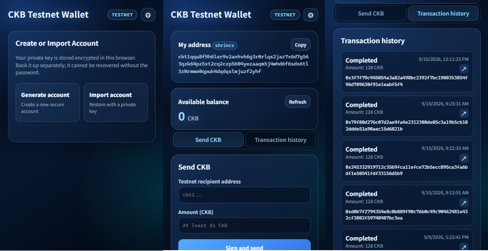

# CKB Testnet Wallet


A testnet web wallet extension for the CKB blockchain.



# Install (Source Code)

```bash
$ git clone https://github.com/mohanson/ckb-web-wallet.git
```

In Chrome, enable **Developer Mode** by toggling the switch in the top right corner of the `chrome://extensions/` page. Click the "Load unpacked" button in the top left corner and select the `ckb-web-wallet/dist` folder where you cloned the repository.

# Install (Chrome Web Store)

TODO: Add link to Chrome Web Store.

# Test account

The test network includes some accounts with funds available for your testing.

| Account Type |                                         Private Key / Seed                                         |
| ------------ | -------------------------------------------------------------------------------------------------- |
| secp256k1    | 0x0000000000000000000000000000000000000000000000000000000000000001                                 |
| secp256k1    | 0x0000000000000000000000000000000000000000000000000000000000000002                                 |
| shrincs      | 0x000000000000000000000000000000000000000000000000000000000000000000000000000000000000000000000001 |

# License

MIT.
